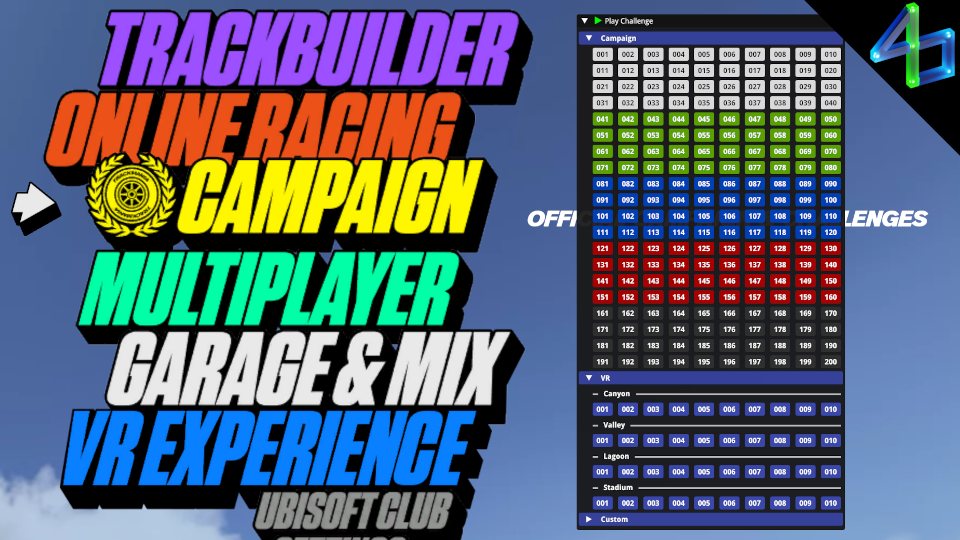

# Play Challenge

A simple map selector for Trackmania Turbo.

## Exports

Use as a dependency in your `info.toml`: `dependencies = [ "PlayChallenge" ]`

```asc
namespace PlayChallenge {
    // whether the game is only the demo/trial
    bool Demo()

    // whether all available campaign maps have been loaded into memory by the plugin
    bool Loaded()

    // play a map from the campaign (001-200)
    // returns true if the input seems valid, not if the map successfully loads
    bool PlayCampaignChallenge(const uint num)

    // play a VR map from the campaign (headset not required)
    // returns true if the input seems valid, not if the map successfully loads
    bool PlayCampaignChallengeVR(const Environment environment, const uint num)

    // play a map from a game path, e.g. Campaigns\\01_White\\01_Canyon\\001.Map.Gbx
    // returns true if the input seems valid, not if the map successfully loads
    bool PlayCustomChallenge(const string&in path)
}
```

<!--  -->
<!--  -->


